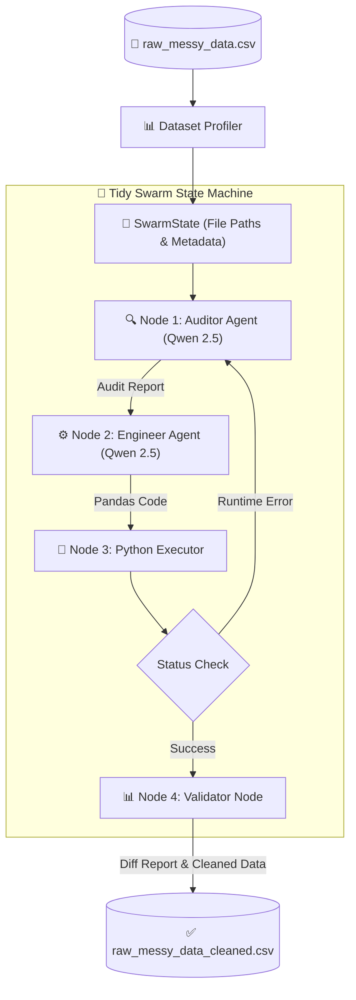

# Tidy Swarm

An autonomous, fully offline, multi-agent data preprocessing pipeline powered by local models running via **Ollama** and orchestrated using **LangGraph**.

`Tidy Swarm` takes messy, real-world CSV files and automatically audits, writes cleaning code for, and executes data transformations all on your local GPU.


## 🏗️ System Architecture
### System Architecture



## ⚙️ Hardware & Stack Requirements
- Package & Env Management: uv
- Local LLM Engine: Ollama
- Target GPU: Optimized for GPUs with ≥8GB VRAM (e.g., RTX 4060).


## 🚀 Quickstart
### 1. Model Setup
Pull the models via Ollama:

```shell
ollama pull qwen2.5:7b
```

### 2. Environment Setup
Clone the repository and install all dependencies using uv:
```
uv sync
```

### 3. Run the Agentic Swarm Pipeline
```
uv run python -m src.main
```


## 🛠️ Configuration
All pipeline variables can be adjusted in src/config.py:

```{python}
AUDITOR_MODEL = "qwen2.5:7b"
ENGINEER_MODEL = "qwen2.5:7b"
OLLAMA_TEMPERATURE = 0.0
MAX_RETRIES = 3
```